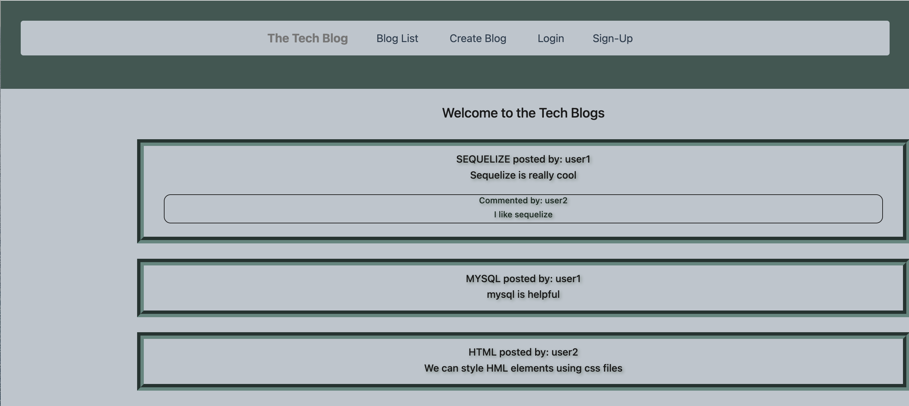

# MVC-TechBlog

## Table of Contents
  - [Description](#description)
  - [Screenshot](#screenshot)
  - [Installation](#installation)
  - [Usage](#usage)
  - [Contact](#contact)

## Description
his is a CMS-style blog site, where developers can publish their blog posts and comment on other developers’ posts. 

## Screenshot
This appliation can run form Visual Studio Code by using npm start.    
     

## Installation
1 - On Develop folder start mysql , then run: source db/schema.sql  
2 - On bash terminal, run: npm i (to initialize)  
3 - On bash terminal, run: npm start (for the app to start running on the server)  

## Usage

## Contact
You can contact me via email: marialda@bellsouth.net
